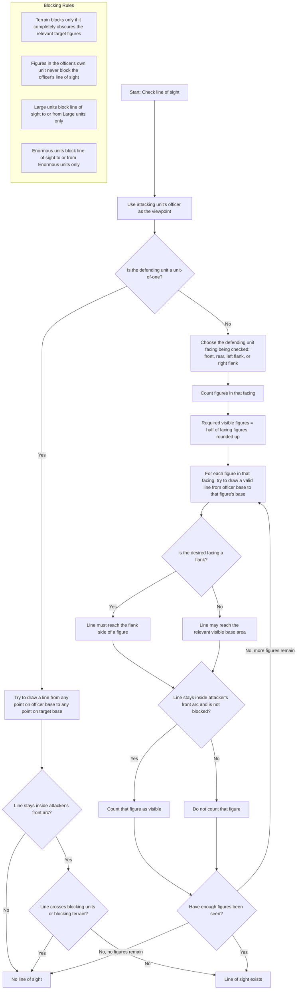

# Rules

## Unit

A Unit is a group of one ore more "mini", also known as a "miniature".

## Base
Units have a "base size" in mm.

- 25x25mm
  - standard "human" size for minis
  - max unit size 20 minis
  - form in rows of 5, leftover in back rank, left flushed
- 25x50mm
  - cavalry, 4 legged beasts
  - max unit size 10 minis
  - form in rows of 5 as 25x25mm
- 50x50mm
  - large monsters such as trolls or ogres
  - max unit size 3
  - 1 row
- 50x100mm
  - largest monsters, such as dragons
  - always a unit of 1
- 100x50mm
  - artillery and other wide crews
  - always a unit of 1

All units designate one mini as the *officer*.  The officer must be placed in one of the two center positions of the first rank.  As minis are removed due to damage, the officer is never selected
until it is the last one remaining.  The officer should use a different marking or something to indicate which one it is.

## Facing

Units have facing.  This is a simple "X" quadrant with the center of the X being the middle point of the unit, disregarding any incomplete final rows if there are more than one row.  
The front facing quadrant is called "front", the others proceding clockwise are "right", "rear", and "left".

## Terrain

The arena is a battlemap measured in millimeters. Each battlemap defines its own width, height, and terrain zones.

- Rough terrain doubles movement cost only for the portion of a move where the unit overlaps it.
- Impassable terrain blocks placement, movement, pivot, about face, combat alignment, and pushback or withdraw movement.
- Path terrain is currently visual only.
- Passable obstacles do not block movement, but a unit moving into combat across or into contact with one counts as attacking an enemy behind fortifications.
- Units must remain within the active battlemap bounds. Pushback and withdraw movement stop at the edge of the map.

## Activating

During play, players alternate activating units.  Each unit is activated once before the next turn.

When activated, unless special rules apply, each unit gets 2 actions.  They can use these actions in any order.

- Move, up to the unit's movement limit in a straight line forward, or backwards up to half of the unit's movement.  If this is done a second time in one activation, the movement rate is halved.  A unit with an `M` stat moves `M * 25mm`; otherwise it uses the default `100mm`.
- Pivot, done by pivoting about the officer to any new direction
- About Face - which reorganizes the back line with a full line and moves the officer
- Shoot at one enemy unit with a listed shooting weapon
- Skip - end the current activation's remaining actions

Special abilities are planned rules, but are not currently available actions.

A unit that fails its activation roll may only take one *simple* action during its activation: move, pivot, about face, or skip.

## Move into Combat

When a unit moves into contact with any part of an enemy unit, it initiates a "move into combat".  When this occurs, the attacking unit is reoriented flush, within a small geometry tolerance for angled contact, with the face of the unit they are attacking, centered on the officer of the attacking unit.

When units are "In combat" due to movement, or due to an activation of one of the enemy units already moved into combat with the unit, a "round of combat" is played.

### Round of Combat

- Determine Combat Dice
- Calculate Target Number
- Roll Combat Dice
- Determine Hits
- Apply Hits / Remove Casualties
- Morale Test
- Pushback

#### Determine Combat Dice

Each side has their own set of dice, calculated by taking the CD value from the unit, rolled X times, where X is:
- if the unit is facing forward and the enemy is contacted forward, then X = the number of units in the front rank.
- if the unit is being attacked by an enemy to any other face (left, right, rear), then X = the number of full ranks in the unit

The final CD is always adjusted to be at least 1, regardless of the prior calculation

#### Calculate Target Number

The target number is the number that needs to be met or exceeded on a D10 roll.

Calculation is: Defending unit's Defense stat (D) - Attacking Unit's Attack stat (A) + modifiers.

Modifiers are:
- ranks, only if fighting an enemy in the front facing: -(1 * number-of-full-ranks-in-unit -1)
- attacking left, right or rear: -1
- unit is defending its rear face: +1
- attacking unit is Disordered (a morale effect): +1
- unit is fighting from a lower elevation: +1 <-- this is a no-op for now, since we don't have elevations, but put in a hook for it with a comment
- unit moved into combat with an enemy behind fortifications: +1, detected when the move crosses or contacts a passable obstacle.

#### Roll Combat Dice

- Roll the sets of combat dice for each unit in the fight

#### Determine Hits

Count up the number of hits, which is:
- 1 for each roll that meets or exceeds the target number
- +1 if it meets or exceeds by 5
- +2 (total) if it meets or exceeds by 10

#### Apply hits / Remove Casualties

Each hit removes one point from the "H" value of the minis in a unit.  Most minis have only 1.  Track hits, starting at the highest numbered mini, and removing that mini when its H value hits 0.  A mini with at least 1 H left is fully-functional, but do track it for future calculations.

Always remove the officer last.

#### Morale test

If a unit loses figures, it must make a "Morale Test".

#### Pushback

The winner of the round of combat is presented with the option to pushback their opposing unit by 25mm or 75mm, or else to themselves withdraw by 25mm.  The pushback or withdraw must be on the same axis in the direction that the attacker was moving before.  The pushback automatically stops at obstacles or the edge of the table. They may also decline either option.

### Morale Tests

The player of a unit needing to make a morale test rolls 2D10 and compares the result to the target number.

Target Number starts at the "A" value for the unit, and is modified as follows:

- casualties: -1 per casualty the unit has suffered
- unit is Disordered: -1
- unit has less than one full rank: -1
- unit has 25x25 bases and has at least two full ranks: +1
- unit has 25x50 bases or 50x50 bases and at least one full rank: +1
- cause of morale test was a shooting attack: +1

Note that a unit-of-one (a champion or large monster) never has any modifiers and must take a morale test whenever it suffers any H damage.

If either die meets or exceeds the target number, the unit passes the test

If it fails, it becomes "Disordered".

If a Disordered unit fails its test, it becomes "Broken" and is removed from the battlefield, counting as a kill for the enemy.

A unit that is completely destroyed is removed and does not take a morale test.

A unit never takes more than one morale test in a turn. If multiple morale triggers would apply, roll only the first test and ignore later morale tests for that unit until the next turn.

A unit becoming "Broken" causes a morale test with no modifiers to friendly units within 8" of the unit.  This can cause a cascade among units owned by the same player.

When only one player has units left on the battlefield, that player wins. If no player has active units left, the game is a draw.

### Disordered Units

- Receive the penalties above
- Have a +1 on their activation values
- when they successfully activate, they remove the disordered status, but can only take a simple action that first round they have reactivated.

# Line of Sight — Pseudo-code Version

```pseudo
function hasLineOfSight(attackingUnit, defendingUnit, desiredFacing):
    # Line of sight is always checked from the attacking unit's officer.
    officerBase = attackingUnit.officer.base

    # The line must remain inside the attacking unit's front arc.
    frontArc = attackingUnit.frontArc

    # Other figures in the officer's own unit do not block line of sight.
    ignoredBlockers = attackingUnit.figures

    if defendingUnit.figureCount == 1:
        return canSeeSingleFigure(
            officerBase,
            defendingUnit.figures[0],
            frontArc,
            ignoredBlockers
        )

    else:
        return canSeeMultiFigureUnit(
            officerBase,
            defendingUnit,
            desiredFacing,
            frontArc,
            ignoredBlockers
        )
```

```pseudo
function canSeeSingleFigure(officerBase, targetFigure, frontArc, ignoredBlockers):
    # The attacker may draw from any point on the officer's base
    # to any point on the target figure's base.

    for each pointA on officerBase:
        for each pointB on targetFigure.base:
            line = drawLine(pointA, pointB)

            if line is inside frontArc
               and line is not blocked by units or blocking terrain,
                   excluding ignoredBlockers:
                return true

    return false
```

```pseudo
function canSeeMultiFigureUnit(officerBase, defendingUnit, desiredFacing, frontArc, ignoredBlockers):
    # For a multi-figure unit, the attacker must see at least half
    # the figures in one facing of the target unit, rounded up.

    facingFigures = defendingUnit.getFiguresInFacing(desiredFacing)

    requiredVisibleFigures = ceiling(count(facingFigures) / 2)

    visibleFigures = 0

    for each figure in facingFigures:
        if canSeeFigureInFacing(
            officerBase,
            figure,
            desiredFacing,
            frontArc,
            ignoredBlockers
        ):
            visibleFigures += 1

    if visibleFigures >= requiredVisibleFigures:
        return true
    else:
        return false
```

```pseudo
function canSeeFigureInFacing(officerBase, targetFigure, desiredFacing, frontArc, ignoredBlockers):
    # A unit may only claim line of sight to a flank
    # if the officer can actually see the flank of a figure.

    visibleArea = targetFigure.getBaseAreaForFacing(desiredFacing)

    for each pointA on officerBase:
        for each pointB on visibleArea:
            line = drawLine(pointA, pointB)

            if line is inside frontArc
               and line is not blocked by units or blocking terrain,
                   excluding ignoredBlockers:
                return true

    return false
```

```pseudo
function isLineBlocked(line, attackingUnit, defendingUnit):
    for each terrainFeature crossed by line:
        # Terrain only blocks line of sight if it completely obscures
        # the relevant target figure or figures.
        if terrainFeature.completelyObscuresTarget(line, defendingUnit):
            return true

    for each unit crossed by line:
        if unit belongs to attackingUnit:
            # Figures in the officer's own unit do not block line of sight.
            continue

        if unit.blocksLineOfSightTo(defendingUnit):
            return true

    return false
```

```pseudo
function blocksLineOfSightTo(blockingUnit, targetUnit):
    # Normal units do not block line of sight to Large or Enormous units
    # unless they have the matching special ability.

    if targetUnit.hasAbility("Enormous"):
        return blockingUnit.hasAbility("Enormous")

    if targetUnit.hasAbility("Large"):
        return blockingUnit.hasAbility("Large")

    # For ordinary-sized targets, other units may block normally,
    # depending on the game's normal obstruction rules.
    return true
```

# Example

```pseudo
# Defending unit: 10 dwarf warriors
# Front rank has 5 figures
# Rear rank has 5 figures
# Left flank has 2 figures
# Right flank has 2 figures

requiredFrontVisible = ceiling(5 / 2) = 3
requiredRearVisible  = ceiling(5 / 2) = 3
requiredLeftVisible  = ceiling(2 / 2) = 1
requiredRightVisible = ceiling(2 / 2) = 1

# Therefore:
# To see the front or rear, the attacker must see at least 3 dwarves.
# To see the left or right flank, the attacker must see at least 1 dwarf.
```

# Flowchart



## Shooting

A unit may use an action to shoot at an enemy unit, no unit without a special ability overriding this rule may shoot twice in the same activation.

Only units with a weapon on the list below may shoot, and their range is limited by the weapon they bear.

Units must have line-of-sight on the target unit, unless they have "Indirect Fire" special ability.

### Weapon Range Table

| Weapon | Range (multiples of 25mm) |
|-------|-------|
| Bow | 20 |
| Elf Bow | 22 |
| Sling | 12 |
| Light Catapult | 32 |
| Heavy Catapult | 40 |
| Ballista | 30 |
| Fire Breath | 12 |

Combat dice are determined as in a close combat role, multiplying the CD of the unit by the number of figures in the front rank.
If the enemy unit has the special ability "shielding" subtract one from the combat dice roll, to a minimum of 1.

### Shooting modifiers table

| Situation | Modifier |
|-----------|----------|
| Full ranks in unit | -1 for each after the first rank |
| This is the second action of an activation | +1 |
| Unit is Disordered | +1 |
| Target in Light Cover (bushes, trees, low walls) | +1 |
| Target in Heavy Cover (purpose built fortifications such as castle walls) | +2 |

### Cover

Cover is any kind of terrain feature that partially blocks line of sight and protects a unit.  A unit must be standing behind cover relative to the attacker to be considered in cover.

### Hits for shooting

Applied with the same modifiers as close combat, with high rolls adding hits.

### Casualties

Applied as with close combat, no retaliation.  Any casualties require a morale test as a result of the attack.
