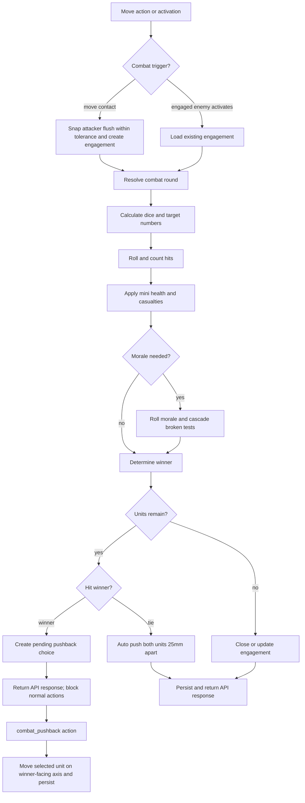

# Combat Feature Plan

## Summary

Implemented the combat rules now present in `RULES.md`: move into combat, round-of-combat dice resolution, hits and casualty removal, morale effects, broken-unit removal, and post-combat pushback or withdraw choices. The implementation keeps combat fully API-driven, rewindable, and visible in the SVG arena.

---

## Problem Frame

Before this work, the engine treated enemy units as blocking movement obstacles in `internal/game/engine.go`; it had no combat state, mini-level health, morale status, or post-combat choice handling. `RULES.md` now defines enough combat behavior to make enemy contact a first-class game transition instead of a movement stop. Because this repo prioritizes automation, every combat roll, modifier, casualty, morale result, and pushback option uses structured JSON feedback rather than UI-only handling.

---

## Requirements

**Move Into Combat**

- R1. A moving unit must detect first contact with any enemy unit during a `move` action.
- R2. On contact, the attacker must be reoriented flush with the defender face being attacked, using the attacking officer as the alignment anchor and allowing a small geometry tolerance for angled contact.
- R3. The final combat pose must not overlap units, impassable terrain, or the arena edge, move the attacking unit as needed to avoid these obstacles.
- R4. The game must record an active engagement with attacker, defender, contacted defender face, initiating action, round, and original movement axis.

**Round of Combat**

- R5. A round of combat must be played when a unit moves into combat.
- R6. A round of combat must also be played when one of the enemy units in an existing engagement activates.
- R7. Each side's combat dice count must be calculated from its `CD` stat and contact geometry:
  - if fighting an enemy on the front face, multiply `CD` by the number of active minis in the front rank;
  - if fighting an enemy on the left, right, or rear face, multiply `CD` by the number of full active ranks;
  - final dice count is at least 1.
- R8. Each side's target number must follow the written rule formula: defending unit `D` minus attacking unit `A`, plus applicable modifiers.
- R9. Combat rolls must record every D10 result, hit count, target number, and modifier used for each side.
- R10. A roll counts as one hit when it meets or exceeds the target number, two hits when it exceeds by at least 5, and three hits when it exceeds by at least 10.

**Casualties and Morale**

- R11. Hits must apply to mini-level health, starting at the highest-numbered active mini.
- R12. Officers must only receive hit allocation when they are the last active mini in the unit.
- R13. A mini with health above 0 remains fully functional; a mini at 0 health is removed from battlefield calculations and SVG rendering.
- R14. A unit that loses one or more minis in a combat round must make a morale test.
- R15. Morale tests must roll 2D10 and pass if either die meets or exceeds the modified target number.
- R16. A failed morale test makes a normal unit `disordered`; a failed morale test by an already disordered unit makes it `broken` and removes it from the battlefield.
- R17. A unit becoming broken must trigger no-modifier morale tests for all units within 8 inches of the broken unit, with cascade behavior handled in the same action resolution.
- R18. Disordered units must apply the combat and activation penalties in `RULES.md`, and must clear disorder only when they successfully activate, at which point they get one simple action for that activation.

**Pushback and Choice State**

- R19. After a combat round where both units remain, the side that delivered more hits must be offered the options to push the opposing unit by up to `150mm` in the winner's facing direction, withdraw itself by `25mm` backward, or decline.
- R20. Pushback and withdraw movement must stop before impassable terrain or the arena edge, ignore rough-ground movement penalties, and chain contacted units far enough to keep at least `25mm` clearance.
- R21. Because pushback is a player choice, the engine must expose it as an explicit pending choice and an explicit API action before normal play continues.
- R21a. If both sides delivered the same number of hits, both combat units must automatically push back `25mm` directly away from each other and no pending choice is created.

**Automation, Persistence, and UI**

- R22. Every combat response must include structured machine-readable results and clear messages.
- R23. Combat state, mini health/removal, disorder, broken status, pending choices, and random progress must be captured by game JSON and rewind snapshots.
- R24. Existing JSON endpoints must remain usable by automation; any new endpoint or action type must return the same `APIResponse` shape where practical.
- R25. The SVG UI must show active engagements, removed minis, disordered units, broken removals, and pending pushback choices without switching away from SVG.

---

## Key Technical Decisions

- KTD1. Combat resolution is engine-owned, not UI-owned: `internal/game` should calculate dice, modifiers, hits, casualties, morale, cascades, and pushback options so browser and automation clients receive the same result.
- KTD2. Store combat as JSON state inside `Game`: `internal/store/store.go` already persists complete game state and snapshots, so adding combat, status, and mini-health fields to `internal/game/types.go` keeps rewind simple and avoids a schema migration.
- KTD3. Split automatic combat resolution from post-combat choice: move/contact and activation-triggered combat can resolve dice immediately, but pushback/withdraw/decline requires a pending choice in game state and a separate action to resolve it.
- KTD4. Track health and removal at mini level: the rules allocate hits to minis, protect the officer until last, and count active front-rank/full-rank minis for later combat calculations.
- KTD5. Make randomness rewindable before adding combat dice: combat and morale add many rolls, so random state must move into `Game` or be otherwise snapshot-restorable. Existing activation rolls should migrate to the same deterministic roll helper.
- KTD6. Implement the target-number formula exactly as written first: the formula in `RULES.md` is the source of truth even if later playtesting adjusts it. Tests should pin the current formula and modifiers.
- KTD7. Add no-op modifier hooks explicitly: lower elevation and fortification modifiers should have named helper functions, with elevation returning no modifier for now and fortification depending on the new passable-obstacle terrain type.
- KTD8. Preserve existing action ergonomics: `ActionMove` and `ActionActivate` remain the trigger points, while new action constants cover `combat_pushback` and any explicit pending-choice submission.

---

## High-Level Technical Design

The combat resolver should return a structured `CombatRoundResult` that can be embedded in `ActionRecord.Result`. It should include per-side dice counts, target numbers, modifiers, rolls, hits, casualties, morale tests, broken removals, engagement updates, and pending choices. Messages should summarize the same data for human readers.

---

## Data Model Shape

The implemented state uses these concepts in `internal/game/types.go`:

- `Mini.HealthRemaining` and `Mini.Removed`.
- Explicit unit status fields: `Disordered bool` and `Broken bool`.
- `CombatEngagement` with ID, attacker unit ID, defender unit ID, defender face, original movement axis, active flag, created round, and created action index.
- `CombatRoundResult` for action history results, including side-specific rolls, modifiers, and tied-combat pushback results.
- `PendingCombatChoice` with engagement ID, winning player, winning unit, losing unit, legal choices, movement axis, and source action index.
- `Game.RandomRollIndex` as the snapshot-restorable random cursor.

Existing games without these fields should unmarshal as healthy, not engaged, not disordered, and with no pending choices.

---

## Scope Boundaries

**In Scope**

- Move into combat alignment.
- Combat dice, target numbers, modifiers, rolls, and hits.
- Mini-level health and casualty removal.
- Morale tests, disorder, broken removal, and broken morale cascades.
- Disordered activation penalty and successful-reactivation cleanup.
- Winner determination and pending pushback/withdraw/decline choices.
- Passable obstacle terrain hook for fortification modifier.
- API and SVG support for the full combat loop.

**Deferred for Later**

- Shooting attacks and shooting-caused morale tests, except keeping the morale modifier hook available.
- Special abilities.
- Elevation terrain, beyond a named no-op modifier hook.
- Multiple simultaneous unit melee groups beyond pairwise engagements created by contact.
- A rich combat log viewer beyond action history/result data.

---

## Implementation Units

### U1. Rewindable Dice and Combat State Foundations

- **Goal:** Add state fields needed for combat while making random rolls snapshot-restorable.
- **Files:** `internal/game/types.go`, `internal/game/engine.go`, `internal/game/engine_test.go`, `internal/server/server_test.go`.
- **Patterns:** Follow existing JSON state and `ActionRecord` structures; keep mutation snapshots flowing through `persistMutation`.
- **Design Notes:** Introduce a roll helper that records enough random progress in `Game` for rewind to reproduce future rolls after restore. Migrate activation rolls to this helper before adding combat rolls, so combat does not deepen the current engine-level RNG mismatch.
- **Test Scenarios:**
  - `internal/game/engine_test.go`: activation rolls still work after the RNG helper migration.
  - `internal/game/engine_test.go`: rewinding before a roll and replaying produces deterministic roll sequences from restored game state.
  - `internal/server/server_test.go`: saved and reloaded games preserve random progress and new zero-value combat fields.
- **Verification:** `go test ./internal/game ./internal/server`.

### U2. Mini Health, Removal, and Unit Status

- **Goal:** Represent active minis, damaged minis, removed minis, disorder, and broken state.
- **Files:** `internal/game/types.go`, `internal/game/engine.go`, `internal/game/engine_test.go`, `web/static/app.js`, `web/static/app.css`.
- **Patterns:** Extend `layoutMinis` and existing mini rendering rather than introducing a separate casualty list.
- **Design Notes:** Initialize each mini's health from `Unit.Stats.H` or a safe default when stats are absent. Active-rank calculations must ignore removed minis. Hit allocation walks highest-numbered non-officer minis first, then officer only when no other active mini remains.
- **Test Scenarios:**
  - `internal/game/engine_test.go`: hits damage the highest-numbered mini first and remove it at 0 health.
  - `internal/game/engine_test.go`: partially damaged minis remain active for front-rank and full-rank calculations.
  - `internal/game/engine_test.go`: officer damage is deferred until the officer is the last active mini.
  - `internal/game/engine_test.go`: broken units are excluded from movement collision and activation choices.
  - Manual browser test: removed minis disappear or render as removed according to the chosen SVG treatment.
- **Verification:** `go test ./internal/game`.

### U3. Move Into Combat Geometry

- **Goal:** Convert enemy contact during movement into a valid engagement and flush combat pose, with a small tolerance for angled contact.
- **Files:** `internal/game/engine.go`, `internal/game/engine_test.go`.
- **Patterns:** Extend existing polygon helpers (`miniWorldPolygon`, `polygonsOverlap`, `unitOverlapsEnemyUnit`) and officer-anchor positioning helpers (`miniWorldCenter`, `pivotOriginForAnchor`).
- **Design Notes:** Movement should detect the first enemy contact candidate, identify the defender face by defender-local quadrant, set attacker facing opposite the contacted face normal, and recompute attacker origin from the attacking officer center. The result must edge-touch without polygon overlap.
- **Test Scenarios:**
  - `internal/game/engine_test.go`: front, right, rear, and left contact identify the correct defender face.
  - `internal/game/engine_test.go`: snapped combat pose is flush or within contact tolerance, non-overlapping, and inside the arena.
  - `internal/game/engine_test.go`: invalid snap against terrain or arena edge reports blocked combat alignment and creates no engagement.
  - `internal/game/engine_test.go`: friendly pass-through and friendly block behavior remain unchanged.
  - `internal/game/engine_test.go`: rough terrain cost before contact is reflected in moved distance.
- **Verification:** `go test ./internal/game`.

### U4. Combat Dice, Target Numbers, and Hit Resolution

- **Goal:** Resolve a combat round through dice calculation, target-number modifiers, roll recording, and hit counts.
- **Files:** `internal/game/engine.go`, `internal/game/engine_test.go`.
- **Patterns:** Keep calculations in small pure helpers so each modifier and dice rule can be tested without full HTTP setup.
- **Design Notes:** Calculate each side independently based on which face of that side is engaged. Add named modifier helpers for ranks, side/rear attack, already-activated non-active unit, rear defense, disorder, lower elevation no-op, and fortification hook.
- **Test Scenarios:**
  - `internal/game/engine_test.go`: front-face combat uses active front-rank mini count times `CD`, minimum 1.
  - `internal/game/engine_test.go`: side or rear combat uses full active rank count times `CD`, minimum 1.
  - `internal/game/engine_test.go`: target-number helper applies every current modifier with traceable labels.
  - `internal/game/engine_test.go`: hit counting returns one, two, or three hits for rolls meeting, exceeding by 5, and exceeding by 10.
  - `internal/game/engine_test.go`: combat round result records rolls, targets, modifiers, and hit totals for both sides.
- **Verification:** `go test ./internal/game`.

### U5. Casualties, Morale, Disorder, Broken Cascades

- **Goal:** Apply combat consequences according to the updated rules.
- **Files:** `internal/game/engine.go`, `internal/game/engine_test.go`.
- **Patterns:** Use action-result detail maps/messages like existing move and activation code, but keep core resolution typed internally.
- **Design Notes:** A unit that loses figures, not merely health, triggers morale. Unit-of-one morale tests should ignore modifiers and trigger whenever any health damage is suffered. Broken cascade tests use no modifiers and check units within 8 inches; the plan should define 8 inches as `8 * 25.4 = 203.2mm` in a constant.
- **Test Scenarios:**
  - `internal/game/engine_test.go`: a unit losing one or more minis rolls morale with casualty, rank, base-size, and disorder modifiers.
  - `internal/game/engine_test.go`: a unit taking damage but losing no mini does not trigger ordinary morale.
  - `internal/game/engine_test.go`: a unit-of-one morale test triggers on any health damage and ignores modifiers.
  - `internal/game/engine_test.go`: failed morale sets disorder; failed morale while disordered sets broken and removes the unit.
  - `internal/game/engine_test.go`: broken-unit cascade morale tests affect units within `203.2mm` and can cascade further.
- **Verification:** `go test ./internal/game`.

### U6. Activation and Legal Action Flow for Combat

- **Goal:** Trigger combat at the correct times and prevent normal play from skipping pending choices.
- **Files:** `internal/game/types.go`, `internal/game/engine.go`, `internal/game/engine_test.go`, `internal/server/server.go`.
- **Patterns:** Follow `Activate`, `ApplyAction`, and `LegalActions` as the current flow gates.
- **Design Notes:** If activating a unit that is the enemy in an active engagement, resolve a combat round as part of activation and return it in the activation action result. If a `PendingCombatChoice` exists, `LegalActions` should expose only the pushback/decline action until the choice is resolved. Successful activation by a disordered unit clears disorder and grants one simple action.
- **Test Scenarios:**
  - `internal/game/engine_test.go`: moving into combat resolves a combat round before action completion.
  - `internal/game/engine_test.go`: activating an enemy unit already in an engagement resolves a combat round.
  - `internal/game/engine_test.go`: pending pushback blocks normal move/pivot/about-face actions.
  - `internal/game/engine_test.go`: successful activation by a disordered unit clears disorder and limits the activation to one simple action.
  - `internal/game/engine_test.go`: disordered activation uses activation value plus one.
- **Verification:** `go test ./internal/game`.

### U7. Pushback, Withdraw, and Fortification Hook

- **Goal:** Implement the player-choice movement after combat and the passable-obstacle hook needed by combat modifiers.
- **Files:** `internal/game/types.go`, `internal/game/engine.go`, `internal/game/engine_test.go`, `internal/server/server.go`, `web/static/app.js`.
- **Patterns:** Reuse stepwise movement stopping logic for terrain and arena edge. Add terrain type constants near existing terrain constants.
- **Design Notes:** Add `ActionCombatPushback` or an equivalent action request type with choices for `pushback_150`, `withdraw_25`, and `decline`. Pushback uses the winner's facing direction and the requested clicked distance up to `150mm`, withdraw moves backward on that axis, both stop at impassable terrain or the arena edge, and pushback chains contacted units to maintain `25mm` clearance. Add passable-obstacle terrain type now, even if no default battlemap uses it yet, so the fortification modifier has a real hook.
- **Test Scenarios:**
  - `internal/game/engine_test.go`: combat winner receives exactly the legal pushback/withdraw/decline choices.
  - `internal/game/engine_test.go`: pushback by a requested distance up to 150mm moves the losing unit in the winner's facing direction and stops at obstacles.
  - `internal/game/engine_test.go`: withdraw by 25mm moves the winning unit backward on the same axis.
  - `internal/game/engine_test.go`: tied combat automatically pushes both combat units 25mm directly away from each other.
  - `internal/game/engine_test.go`: pushback chains contacted units far enough to maintain 25mm clearance.
  - `internal/game/engine_test.go`: decline clears the pending choice without moving units.
  - `internal/game/engine_test.go`: fortification hook adds the modifier when movement into combat crosses or contacts a passable obstacle.
- **Verification:** `go test ./internal/game`.

### U8. HTTP API and Persistence Coverage

- **Goal:** Expose the full combat loop through JSON and prove it survives persistence and rewind.
- **Files:** `internal/server/server.go`, `internal/server/server_test.go`, `internal/store/store.go`.
- **Patterns:** Keep mutation routes wrapping engine calls with pre-action snapshots and returning `game.APIResponse`.
- **Design Notes:** Prefer routing pushback through the existing `POST /api/games/{id}/actions` path if the payload can stay coherent; add a dedicated endpoint only if the action payload becomes ambiguous. `pushback_150` must require and validate `distanceMm` greater than `0` and no more than `150`, while `withdraw_25` and `decline` keep their fixed behavior. In either case, response shape should include `ok`, `game`, `action`, `legalActions`, `messages`, and `errors`.
- **Test Scenarios:**
  - `internal/server/server_test.go`: full HTTP flow creates game, places units, activates, moves into combat, receives combat result, resolves pushback, reloads, and sees persisted state.
  - `internal/server/server_test.go`: rewind before combat restores unit pose, mini health, statuses, engagements, pending choices, and random progress.
  - `internal/server/server_test.go`: invalid pushback choice or pushback distance returns `400` with a useful error.
  - `internal/server/server_test.go`: combat result JSON contains rolls, modifiers, hits, casualties, morale, and pending choice data.
- **Verification:** `go test ./internal/server`.

### U9. SVG Combat UI and Feedback

- **Goal:** Make combat understandable in the existing Alpine/SVG interface without reducing API completeness.
- **Files:** `web/static/app.js`, `web/static/app.css`, `web/templates/index.html`.
- **Patterns:** Extend existing `renderArena`, messages, action controls, and history list.
- **Design Notes:** Add helpers for active minis, engaged units, unit status labels, pending combat choice controls, and combat result summaries. Render removed minis distinctly or omit them, but keep enough markers for users to understand casualties. Add styles for engaged, disordered, broken/removed, and pending-choice states.
- **Test Scenarios:**
  - Manual browser test: moving into combat shows engaged units and a combat summary.
  - Manual browser test: pending pushback controls appear and normal action controls are disabled until resolved.
  - Manual browser test: casualty removal and disordered status are visible in the arena or unit label.
  - Manual browser test: rewind removes combat effects and restores SVG state.
  - Optional browser automation: assert DOM classes for engaged/disordered and pending choice controls after seeded combat.
- **Verification:** `go test ./...` plus one local browser run through combat and rewind.

---

## Acceptance Examples

- AE1. **Move Into Combat and Resolve Round**
  - **Covers:** R1, R2, R3, R4, R5, R9, R22
  - **Given:** An activated unit has enough movement to contact an enemy unit.
  - **When:** The player submits a move action.
  - **Then:** The attacker snaps flush to the defender face within contact tolerance, an engagement is recorded, a combat round is resolved, and the action result includes rolls, target numbers, hits, and any pending pushback choice.

- AE2. **Officer-Safe Casualties**
  - **Covers:** R11, R12, R13
  - **Given:** A unit with multiple active minis takes enough hits to remove minis.
  - **When:** Hits are applied.
  - **Then:** The highest-numbered non-officer minis are damaged and removed first, and the officer remains active unless it is the last mini.

- AE3. **Morale Failure Cascade**
  - **Covers:** R14, R15, R16, R17
  - **Given:** A disordered unit loses a mini, fails morale, and becomes broken near other units.
  - **When:** The combat round resolves.
  - **Then:** The broken unit is removed, nearby units within `203.2mm` take no-modifier morale tests, and any further broken results cascade in the same action result.

- AE4. **Pushback Choice**
  - **Covers:** R19, R20, R21
  - **Given:** Combat produces a winner and both units remain on the battlefield.
  - **When:** The action response is returned.
  - **Then:** The game exposes only the legal pending pushback choices until the winner submits `pushback_150` with a requested distance, `withdraw_25`, or `decline`.

- AE4a. **Tied Combat Pushback**
  - **Covers:** R21a
  - **Given:** Combat hits are tied and both units remain on the battlefield.
  - **When:** The combat round resolves.
  - **Then:** The action result records tied pushback for both units and no pending combat choice is created.

- AE5. **Rewind Combat**
  - **Covers:** R23
  - **Given:** A combat round and pushback have both been recorded.
  - **When:** The client rewinds to the combat action snapshot.
  - **Then:** unit pose, engagement state, mini health/removal, morale statuses, pending choices, action history, and random progress match the pre-combat state.

---

## System-Wide Impact

- **Game engine:** Movement, activation, legal actions, status effects, and randomness all need coordinated changes.
- **Persistence:** Game JSON expands, but SQLite tables can remain unchanged if all combat state stays inside `Game`.
- **API clients:** Existing move and activation calls continue to work, but clients must handle combat-rich action results and pending choice gates.
- **Browser UI:** The arena remains SVG and Alpine-driven, but controls need a pending-combat mode.
- **Rules evolution:** Combat helpers should be small and named by rule concepts so later shooting, special abilities, and terrain rules can reuse them.

---

## Risks and Dependencies

- **Target formula ambiguity:** The written target-number formula may produce counterintuitive probabilities as `D - A` plus modifiers. Mitigation: implement the text exactly, isolate the helper, and pin tests so later rule edits are straightforward.
- **Random rewind correctness:** Activation, combat, and morale rolls now use `Game.RandomRollIndex` so snapshots restore random progress.
- **Pushback timing:** Pushback is a player choice inside a combat round. Mitigation: model it as pending state so automation can inspect and submit the choice explicitly.
- **Casualty state compatibility:** Existing game JSON lacks mini health fields. Mitigation: zero-value handling should treat missing mini health as full health from unit stats/defaults during load or before first combat calculation.
- **Geometry edge cases:** Flush alignment can fail near obstacles or arena edges. Mitigation: validate final pose and return blocked alignment feedback instead of forcing overlap.
- **Cascade complexity:** Broken morale cascades can recurse. Mitigation: process cascades through an explicit queue and record every morale test in the combat result.

---

## Sources and Existing Patterns

- `RULES.md`: Source for move into combat, round-of-combat sequence, combat dice, target modifiers, hits, casualties, morale, pushback, and disorder.
- `PLAN.md`: Establishes the current architecture: Go engine, SQLite snapshots, JSON APIs, Alpine, and SVG.
- `internal/game/types.go`: Owns game state, action constants, API response types, action requests, and rewind request shape.
- `internal/game/engine.go`: Owns movement, activation, action history, snapshots, unit geometry, terrain checks, and legal actions.
- `internal/store/store.go`: Persists full game JSON and snapshots, which should carry combat state without schema changes.
- `internal/server/server.go`: Wraps engine mutations with snapshots and returns JSON responses.
- `web/static/app.js`: Renders units and terrain into SVG and submits all current actions through the JSON API.
- `internal/game/engine_test.go` and `internal/server/server_test.go`: Existing regression coverage style for movement, geometry, activation, persistence, and rewind.
