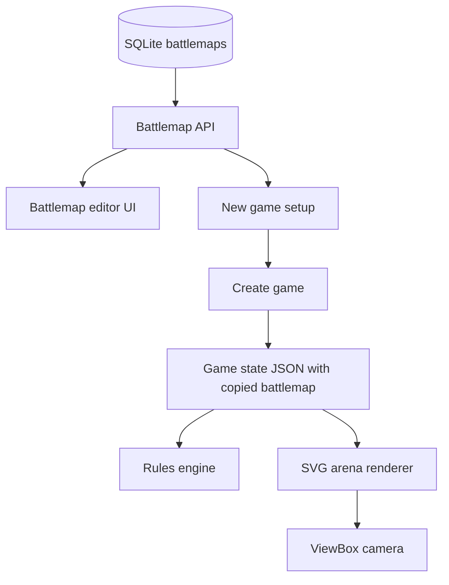
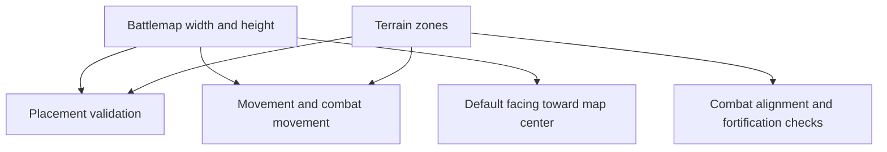

# feat: Add Battlemap Zoom and Editor

## Summary

Add persisted, reusable battlemaps with rectangular terrain editing, let new games copy a saved battlemap into game state, and replace the fixed-size arena with a battlemap-sized SVG camera that zooms from full-map fit down to a 200mm minimum visible side.

---

## Problem Frame

The current arena is fixed at 760x520mm in both SVG markup and rule validation. That blocks large battlemaps, prevents reusable scenario authoring, and leaves browser behavior ahead of automation if zoom and editing are solved only in client code. The plan extends the current Go, SQLite, Alpine.js, and SVG patterns so saved battlemaps, game rules, rewind snapshots, and AI clients all operate on the same millimeter-based map definition.

---

## Requirements

**Battlemap Library and API**

- R1. Users and automation clients can list, create, retrieve, update, and delete reusable battlemaps with name, dimensions, and rectangular terrain zones.
- R2. Built-in starter maps remain available as default saved battlemaps and existing game snapshots continue to load.
- R3. Battlemap validation rejects empty names, invalid dimensions, unsupported terrain types, non-rect terrain, and out-of-bounds terrain with structured JSON errors.

**Game Integration and Rules**

- R4. New-game setup selects a saved battlemap and copies its full definition into game state.
- R5. Game rules use the active battlemap width and height for placement, movement, combat alignment, pushback, withdraw, and default facing.
- R6. Rewind restores the game-local battlemap copy exactly as part of the existing snapshot flow.

**SVG Camera and Editor**

- R7. The play arena renders from battlemap dimensions rather than fixed 760x520 SVG bounds.
- R8. The arena camera supports fit-to-map, zoom in, zoom out, pan, and clamped camera bounds.
- R9. Maximum zoom-in keeps the shorter visible side at least 200mm while preserving the SVG aspect ratio.
- R10. The battlemap editor supports adding, selecting, moving, resizing, updating, and deleting rectangular terrain zones in millimeter coordinates.
- R11. Browser clicks, placement previews, and editor interactions continue to use SVG world coordinates that match server-side map coordinates.

---

## Key Technical Decisions

- **Persist battlemaps separately from games:** Store reusable battlemaps in SQLite and keep game state JSON as the source of truth for a started game's copied map. This satisfies reusable authoring without making old games mutable when a library map changes.
- **Move dimensions into `game.Battlemap`:** The rules engine should ask the active battlemap for bounds instead of reading global arena constants. This keeps built-in, saved, large, and copied maps on the same path.
- **Seed starter maps through store initialization:** The current `old_road` and `forest_wall` maps should be available through the battlemap API so new-game setup has one source for choices.
- **Protect starter maps in the library:** Starter maps should be upserted by store initialization and protected from accidental deletion. Custom battlemaps remain fully deletable.
- **Keep terrain zones rectangular in v1:** Rectangles match the current renderer and collision code, so the editor can be useful without polygon geometry or drawing-tool complexity.
- **Use SVG `viewBox` as camera state:** The SVG remains in millimeter world coordinates while `viewBox` changes the visible area. This preserves `createSVGPoint()` click translation and avoids CSS transform drift.
- **Keep camera state client-local:** Zoom and pan do not affect rules, history, or rewind. Rewind only restores game state, including the copied battlemap.

---

## High-Level Technical Design

---

## Implementation Units

### U1. Battlemap domain model and validation

- **Goal:** Extend the game domain so a battlemap carries dimensions and can be validated independently of games.
- **Requirements:** R2, R3, R5
- **Dependencies:** None
- **Files:** `internal/game/types.go`, `internal/game/engine.go`, `internal/game/engine_test.go`
- **Approach:** Add width and height fields to `Battlemap`, normalize legacy maps that lack dimensions to the current 760x520 default, and centralize battlemap validation for name, dimensions, terrain type, shape, and geometry. Replace direct uses of fixed arena dimensions with helpers that accept the active battlemap.
- **Patterns to follow:** Existing `TerrainZone` modeling in `internal/game/types.go`; current placement and movement validation in `internal/game/engine.go`; engine table-style tests in `internal/game/engine_test.go`.
- **Test scenarios:**
  - Valid built-in battlemaps normalize to dimensions and pass validation.
  - Legacy game JSON with no battlemap dimensions restores to 760x520 dimensions.
  - A battlemap with width or height at zero is rejected with a useful error.
  - A terrain zone with unsupported type, unsupported shape, negative size, or out-of-bounds geometry is rejected.
  - Placement near the right and bottom edges uses the active battlemap dimensions rather than the previous global constants.
  - Default placement facing points toward the active battlemap center on a non-760x520 map.
- **Verification:** Engine tests prove legacy compatibility, validation behavior, and variable-size bounds.

### U2. Persist reusable battlemaps

- **Goal:** Add SQLite-backed CRUD for reusable battlemaps and seed the starter maps into the library.
- **Requirements:** R1, R2, R3
- **Dependencies:** U1
- **Files:** `internal/store/store.go`, `internal/store/battlemaps.go`, `internal/store/battlemaps_test.go`
- **Approach:** Add a persisted battlemap table that stores battlemap metadata and terrain JSON, then expose store methods for list, get, create, update, and delete. Seed or upsert starter maps during store open so the old choices are available through the same API as user-authored maps.
- **Patterns to follow:** Store migration style in `internal/store/store.go`; CRUD shape and timestamp handling in `internal/store/armies.go`; store tests using temporary SQLite databases in `internal/store/armies_test.go`.
- **Test scenarios:**
  - Opening a new store seeds `old_road` and `forest_wall` as saved battlemaps.
  - Creating a valid custom battlemap persists dimensions and terrain zones.
  - Updating a battlemap changes metadata and terrain while preserving its ID.
  - Deleting a custom battlemap removes it from list and get results.
  - Starter maps remain available after store initialization and cannot be accidentally removed from the default library.
  - Invalid battlemap data is rejected before it reaches persistent storage.
- **Verification:** Store tests cover CRUD, validation propagation, starter map availability, and timestamp/list ordering.

### U3. Expose battlemap API and create-game selection

- **Goal:** Make battlemap management and game creation available through structured server behavior.
- **Requirements:** R1, R3, R4, R6
- **Dependencies:** U1, U2
- **Files:** `internal/server/server.go`, `internal/server/server_test.go`, `internal/game/types.go`
- **Approach:** Add battlemap API handlers following the existing army/template JSON conventions. Update game creation so a `battlemapId` is resolved from the store and passed as a copied battlemap definition to the engine, while preserving compatibility for built-in IDs during the transition.
- **Patterns to follow:** Existing `/api/army-templates`, `/api/armies`, `/api/games`, and error response helpers in `internal/server/server.go`.
- **Test scenarios:**
  - `GET` list returns seeded and custom battlemaps with dimensions and terrain counts or full terrain as appropriate.
  - `POST` create returns the saved battlemap and a success message.
  - `PATCH` update preserves omitted fields and rejects invalid geometry.
  - `DELETE` custom battlemap removes it and returns a useful message.
  - Creating a game from a saved battlemap copies the full battlemap into game state.
  - Covers AE2. Editing the reusable battlemap after game creation does not change the existing game or rewind snapshots.
  - Unknown `battlemapId` returns a structured bad-request error.
- **Verification:** HTTP tests prove CRUD contracts, create-game selection, copy-on-start behavior, and rewind preservation.

### U4. Apply active battlemap bounds across engine movement

- **Goal:** Remove hidden fixed-arena assumptions from movement, placement, combat alignment, and combat choice movement.
- **Requirements:** R5, R6
- **Dependencies:** U1
- **Files:** `internal/game/engine.go`, `internal/game/engine_test.go`
- **Approach:** Thread active battlemap bounds through rule helpers that currently call fixed arena checks. Keep pure helper tests possible by giving helpers an explicit bounds input or defaulting only in legacy helper contexts.
- **Patterns to follow:** Existing collision helpers around `unitOverlapsTerrain`, `validateUnitPosition`, `snapAttackerFlush`, and `moveCombatChoiceUnit`.
- **Test scenarios:**
  - Covers AE3. A unit can be placed beyond 760mm on a wider battlemap when fully inside that map.
  - Placement beyond the active battlemap width or height is rejected.
  - Forward movement stops at the active battlemap edge on a custom-size map.
  - Combat pushback and withdraw stop at the active battlemap edge.
  - Combat alignment rejects poses outside the active battlemap but accepts poses outside the old global bounds when the custom map allows them.
  - Existing rough, impassable, friendly overlap, and enemy contact tests still pass with the default bounds.
- **Verification:** Engine tests exercise custom map dimensions for every rules path that uses arena boundaries.

### U5. Load battlemaps in new-game UI

- **Goal:** Replace hard-coded battlemap choices in new-game setup with saved battlemaps from the API.
- **Requirements:** R1, R4
- **Dependencies:** U3
- **Files:** `web/templates/index.html`, `web/static/app.js`, `web/static/app.css`, `internal/server/server_test.go`
- **Approach:** Load battlemaps during app initialization and new-game setup, render them in the battlemap selector, and keep a safe default when the list is empty or still loading. Preserve current army setup behavior.
- **Patterns to follow:** Existing `loadArmies`, saved-game modal, and Alpine state shape in `web/static/app.js`; modal styling in `web/static/app.css`.
- **Test scenarios:**
  - New-game setup lists seeded battlemaps loaded from the server.
  - Creating a game sends the selected saved battlemap ID.
  - The UI handles battlemap API errors by showing messages without breaking army setup.
  - Server-side tests cover the API contract that the UI consumes.
- **Verification:** Browser behavior shows saved maps in setup, and HTTP tests cover the underlying data path.

### U6. Implement SVG camera for play arena

- **Goal:** Add zoom and pan controls to the play arena while preserving world-coordinate interactions.
- **Requirements:** R7, R8, R9, R11
- **Dependencies:** U1, U5
- **Files:** `web/templates/index.html`, `web/static/app.js`, `web/static/app.css`
- **Approach:** Derive the SVG `viewBox`, background rectangle, grid fill, and pan/zoom limits from `game.battlemap.widthMm` and `game.battlemap.heightMm`. Add fit, zoom in, zoom out, and drag or button pan behavior that clamps to map bounds and stops zoom-in at a 200mm shorter visible side.
- **Patterns to follow:** Existing `arenaPoint`, `renderArenaSoon`, and dynamic SVG rendering in `web/static/app.js`; arena styling in `web/static/app.css`.
- **Test scenarios:**
  - Covers AE1. A large map can fit fully in the visible arena.
  - Repeated zoom-in stops when the shorter visible side reaches 200mm or more.
  - Panning cannot move the battlemap entirely out of view.
  - Covers AE3. Clicking while zoomed and panned produces correct world coordinates for placement preview and placement submission.
  - Loading or rewinding a different game resets or clamps camera state to that game's map dimensions.
- **Verification:** Manual browser check confirms fit-to-map, zoom, pan, placement, and selection on default and large maps.

### U7. Build rectangular battlemap editor UI

- **Goal:** Provide a browser UI for managing saved battlemaps and rectangular terrain zones.
- **Requirements:** R1, R3, R10, R11
- **Dependencies:** U3, U6
- **Files:** `web/templates/index.html`, `web/static/app.js`, `web/static/app.css`, `internal/server/server_test.go`
- **Approach:** Add a battlemap library/editor surface that lists saved maps, edits name and dimensions, renders terrain rectangles in SVG, and provides controls for terrain type, label, position, and size. Use the same camera and terrain rendering concepts as the play arena, but keep editor state separate from active game state.
- **Patterns to follow:** Existing armies management style in `web/templates/armies.html` and `createArmiesManager` for list/detail editing; existing terrain rendering in `createMiniswarApp`.
- **Test scenarios:**
  - A user can create a new battlemap, set dimensions, add terrain, save, and see it in the library.
  - A user can select, update, move, resize, and delete a terrain rectangle.
  - Covers AE4. An out-of-bounds terrain rectangle shows structured validation feedback from the server.
  - Editing a reusable battlemap does not mutate the currently loaded game's copied battlemap.
  - The editor remains usable on narrow screens without overlapping the arena controls.
- **Verification:** Manual browser check covers create/edit/delete map and terrain flows; HTTP tests cover the validation and persistence contracts.

### U8. Documentation and regression sweep

- **Goal:** Update project documentation and run an end-to-end verification pass over the new battlemap behavior.
- **Requirements:** R1-R11
- **Dependencies:** U1, U2, U3, U4, U5, U6, U7
- **Files:** `PLAN.md`, `RULES.md`, `internal/game/engine_test.go`, `internal/store/battlemaps_test.go`, `internal/server/server_test.go`
- **Approach:** Update the project overview so future agents know battlemaps are persisted assets with copied game state and variable dimensions. Add or adjust tests where integration gaps remain after the feature units.
- **Patterns to follow:** Current feature summary and API inventory in `PLAN.md`; terrain rule language in `RULES.md`; existing package test organization.
- **Test scenarios:**
  - Full game creation, placement, activation, movement, action history, and rewind still work on starter maps.
  - Large custom map creation, game start, zoomed placement, movement near old bounds, and rewind all work together.
  - Battlemap API errors use the same JSON response conventions as the rest of the app.
- **Verification:** Package tests pass for game, store, and server behavior; manual browser check covers map authoring and play on a large map.

---

## Scope Boundaries

### Deferred to Follow-Up Work

- Freeform terrain, polygons, brush drawing, imported images, and map art layers.
- Deployment zones, scenario objectives, scripted setup rules, and scenario notes.
- Minimap navigation and shareable camera bookmarks.
- Battlemap versioning UX beyond preserving a game-local copied definition.
- Dedicated browser automation tests for camera interaction, if the first pass relies on manual browser verification.

### Outside This Product's First Pass

- Canvas rendering for the play area.
- React-based battlemap editing.
- UI-only battlemap behavior that cannot be exercised through structured server behavior.

---

## System-Wide Impact

- **Persistence:** Adds a reusable battlemap data lifecycle alongside games, snapshots, army templates, and rosters.
- **Game state compatibility:** Existing serialized games need normalization because old battlemap JSON lacks dimensions.
- **Rules correctness:** Every rule path that references arena bounds must move to active battlemap bounds.
- **Frontend interaction model:** SVG viewBox changes affect click translation, drag behavior, labels, grid density, and placement previews.
- **Automation parity:** Battlemap CRUD and validation must be API-visible because game setup and terrain authoring are not browser-only workflows.

---

## Risks and Mitigations

- **Risk:** Hidden fixed-size assumptions remain in tests or helper functions.  
  **Mitigation:** Add custom-dimension tests for placement, movement, combat alignment, pushback, withdraw, and default facing.

- **Risk:** Editing reusable maps accidentally mutates in-progress games.  
  **Mitigation:** Keep the started game on copied battlemap JSON and test post-edit game reload plus rewind.

- **Risk:** SVG camera math breaks click-to-world coordinates.  
  **Mitigation:** Use SVG viewBox for zoom/pan and keep `createSVGPoint()` coordinate conversion as the core click path.

- **Risk:** The editor grows into a drawing application.  
  **Mitigation:** Keep v1 controls rectangle-only and route richer authoring to follow-up work.

---

## Acceptance Examples

- AE1. Given a battlemap much larger than the viewport, when the user chooses fit-to-map, then the full map is visible. When the user zooms in repeatedly, then the shorter visible side stops at 200mm or more.
- AE2. Given a game created from a saved battlemap, when the reusable battlemap is later edited, then the existing game and its rewind snapshots still use the original copied definition.
- AE3. Given the arena is zoomed and panned, when the player clicks to place a unit, then the server receives millimeter coordinates in the battlemap world and validates them against the active map bounds.
- AE4. Given an author creates a terrain rectangle extending outside the map, when they save, then the save is rejected with structured feedback identifying the invalid zone.

---

## Documentation / Operational Notes

- Update `PLAN.md` so future work knows battlemaps are reusable SQLite records and games store copied battlemap definitions.
- Update `RULES.md` only where terrain or arena-size language still implies a fixed battlefield.
- Keep default starter maps available after migration so existing examples and tests remain easy to follow.

---

## Sources / Research

- `docs/brainstorms/2026-06-10-battlemap-zoom-editor-requirements.md` defines the product scope, requirements, actors, flows, and acceptance examples.
- `AGENTS.md` requires SQLite persistence, SVG-only play area rendering, millimeter coordinates, automation-friendly actions, and rewind support.
- `PLAN.md` documents current game APIs, action feedback, SVG arena, battlemap IDs, and fixed built-in maps.
- `internal/game/types.go` contains the current `Battlemap`, `TerrainZone`, `Game`, `APIResponse`, and request/summary types.
- `internal/game/engine.go` contains built-in maps, fixed arena constants, placement, movement, combat movement, snapshots, restore, and normalization.
- `internal/store/store.go` and `internal/store/armies.go` show migration, JSON persistence, seeded catalog import, and CRUD conventions.
- `internal/server/server.go` shows route registration, JSON error conventions, game creation, mutation persistence, and army/template CRUD patterns.
- `web/templates/index.html`, `web/static/app.js`, and `web/static/app.css` contain the fixed SVG arena, hard-coded battlemap selector, Alpine state, click-to-SVG coordinate conversion, terrain rendering, and existing management UI patterns.
