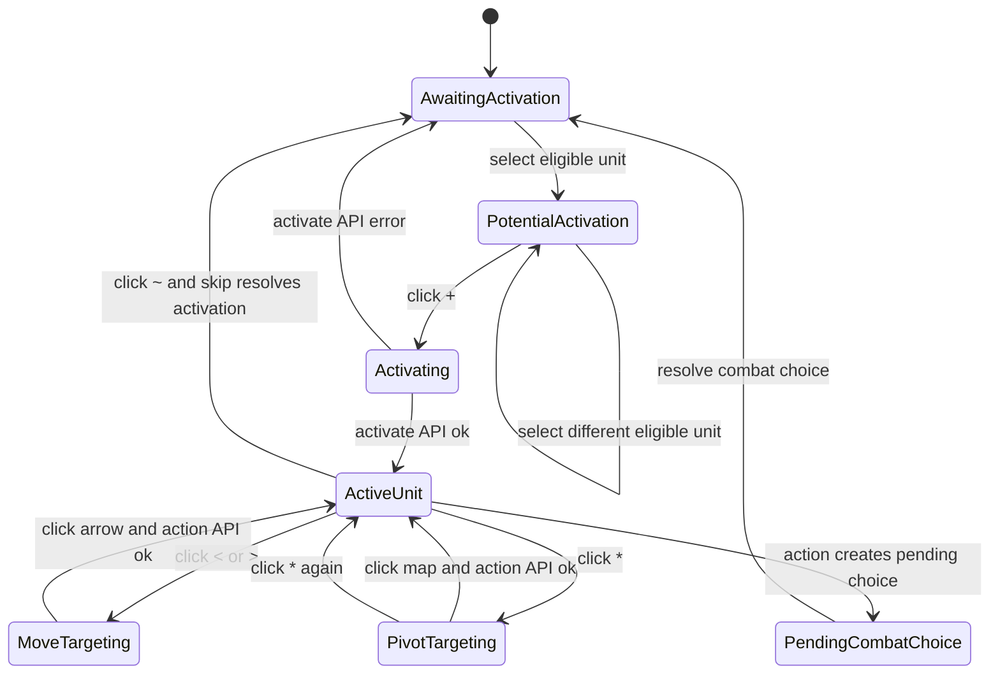
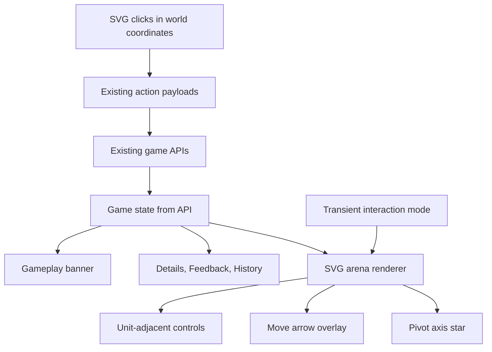

# feat: Add Contextual Game Controls

## Summary

Replace the right-side Activation and Actions panel with contextual SVG controls near the unit being acted on. Move Feedback and History into the left bar, add a top gameplay banner, and translate battlemap clicks into the existing activation, move, pivot, about-face, skip, and combat-choice API calls without changing backend behavior.

---

## Problem Frame

The current game screen asks the player to select a unit in the SVG arena, then look to the right panel to activate it or fill action forms for distance and facing. That splits attention between the unit and the command input, and it makes movement and rotation require guessed numeric values. The repo already has an Alpine.js state object, direct SVG rendering, millimeter world-coordinate click translation, structured API feedback, action history, and rewind snapshots, so this work should reshape the browser interaction while keeping the JSON command surface stable for automation.

---

## Requirements

**Layout and Information**

- R1. The game screen no longer renders the right Activation and Actions section during play.
- R2. Feedback messages and action history move into the left bar with Details, remain visible during play, and continue to support rewind.
- R3. A top gameplay banner shows the current activation prompt, activation result, action count, pending combat choice, setup, and complete-game states.

**Contextual Activation and Actions**

- R4. When a player is awaiting activation, selecting an activatable unit highlights it and renders a unit-adjacent `+` activation control; selecting another eligible unit moves the pending activation control.
- R5. Activating through the `+` control calls the existing activate endpoint and updates the banner from the API result, including two-action success and one-action simple activation cases.
- R6. Once a unit is activated, the UI renders unit-adjacent `<`, `*`, `>`, and `~` controls for backward move, pivot or rotate, forward move, and skip.
- R7. Pending combat choice remains playable after the right panel is removed.

**Battlemap Input**

- R8. Choosing forward or backward move draws a player-colored SVG arrow from the active unit in that direction to the maximum requestable movement for the current activation.
- R9. Clicking along the move arrow submits the existing `move` action with direction and clicked distance; the server remains authoritative for terrain, collision, combat, and actual distance moved.
- R10. Choosing pivot highlights the pivot axis mini with a star, defaulting to the officer unless the player selects another mini on the active unit.
- R11. While pivot mode is active, a battlemap click submits the existing `pivot` action toward that direction, except a directly backward snapped direction submits the existing `about_face` action.
- R12. Clicking the any action control while another is active, for example clicking forward while pivot is active, changes the active action to the clicked control.
- R13. Clicking the active action control again cancels the active action.

**Project Constraints**

- R14. The arena and controls remain SVG, not canvas, and the implementation does not introduce React.
- R15. Backend command semantics, endpoint paths, action record history, structured feedback, and rewind behavior remain unchanged.

---

## Key Technical Decisions

- **Use transient Alpine interaction modes:** Add client-only state for pending activation, move direction, pivot targeting, and pending combat choice overlays. This keeps rewind and automation grounded in server state while letting the UI track in-progress pointer input.
- **Render contextual controls inside the SVG:** Buttons, arrows, and pivot stars should be SVG elements appended by the existing render path so their positions share the same millimeter coordinate system as units and terrain.
- **Keep the server as the rules authority:** The move arrow represents the maximum requestable distance from visible activation state, not a collision or terrain simulator. API messages and action results tell the player what actually happened.
- **Reuse existing command methods:** `activate`, `takeAction`, and `resolveCombatChoice` can be reshaped or split into smaller helpers, but payloads should still target the existing `/activate` and `/actions` endpoints.
- **Snap pivot input consistently with placement:** Do not use the existing 45-degree snapped direction convention for map-click facing, instead derive the facing from the click position relative to the currently selected pivot figure's current position. If the snapped facing is opposite the unit's current facing, submit `about_face`; otherwise submit `pivot`.
- **Preserve combat choice as a contextual exception:** Pending pushback, withdraw, or decline is already an action gate. Render it near the winning unit or in the left bar as a fallback, but do not leave it dependent on the removed right panel.

---

## High-Level Technical Design

---

## Implementation Units

### U1. Reshape the Game Shell Layout

- **Goal:** Remove the play-mode right controls column and move Feedback and History into the left bar.
- **Requirements:** R1, R2, R13
- **Dependencies:** None
- **Files:** `web/templates/index.html`, `web/static/app.css`, `web/static/app.js`
- **Approach:** Keep the existing setup sidebar concept, but make the left bar the single play sidebar for Details, Feedback, and History. Remove the play-mode Activation and Actions form markup from the right controls column and update grid rules so play mode uses left sidebar plus arena. Preserve setup behavior, load-game modals, and battlemap controls.
- **Patterns to follow:** Current `.shell`, `.setup`, `.controls`, `.details-panel`, `.messages`, and `.history` styles in `web/static/app.css`; current left Details section in `web/templates/index.html`.
- **Test scenarios:**
  - Start or load a game in play phase and confirm there is no right-side Activation or Actions panel.
  - Select a unit and verify Details, Feedback, and History remain visible in the left bar.
  - Take an action, then rewind from History and confirm the left bar updates messages and selected details.
  - Enter setup phase and confirm placement controls still appear and the setup sidebar collapse behavior still works.
- **Verification:** Manual browser check proves the game screen has no right action panel, preserves setup ergonomics, and keeps Feedback and History usable.

### U2. Add Gameplay Banner State

- **Goal:** Add a top banner that gives the player immediate activation and action status.
- **Requirements:** R3, R5, R7, R14
- **Dependencies:** U1
- **Files:** `web/templates/index.html`, `web/static/app.js`, `web/static/app.css`
- **Approach:** Add a play banner in the arena panel, backed by a helper that derives text from `game.phase`, `game.activePlayer`, `game.currentActivation`, `game.pendingCombatChoice`, `messages`, and the last activation action. Keep `statusLine()` for the page header, but make the new banner the gameplay prompt.
- **Patterns to follow:** Existing `statusLine()`, `selectedUnitLabel()`, `pendingCombatChoice()`, and response message handling in `web/static/app.js`.
- **Test scenarios:**
  - Awaiting activation shows `Player X - Activating`.
  - Successful activation with two actions shows `Activation Succeeded - Action 1/2`.
  - Failed activation or disordered simple activation shows a one-action simple activation state.
  - After one action from a two-action activation, the banner advances to `Action 2/2`.
  - Pending combat choice and complete-game states override normal activation prompts.
- **Verification:** Browser state changes match existing API responses and current activation state after activate, action, combat choice, skip, and rewind.

### U3. Build Contextual SVG Overlay Infrastructure

- **Goal:** Provide a reusable SVG overlay layer for unit-adjacent controls, arrows, and pivot markers.
- **Requirements:** R4, R6, R8, R10, R13
- **Dependencies:** U1, U2
- **Files:** `web/templates/index.html`, `web/static/app.js`, `web/static/app.css`
- **Approach:** Add an SVG overlay group after unit rendering or as part of the same render pass. Compute unit world bounds from existing mini geometry helpers, place control hit targets below the selected or active unit, and style controls with player color and high-contrast labels. Keep control sizes readable at different zoom levels by deriving their map-unit size from the current camera.
- **Patterns to follow:** `renderArena()`, `localUnitBounds()`, `rotatePoint()`, `arenaPoint()`, and existing SVG element creation in `web/static/app.js`.
- **Test scenarios:**
  - Selecting an eligible unit while awaiting activation renders only the `+` control for that unit.
  - Activating a unit renders `<`, `*`, `>`, and `~` below that unit.
  - Zooming and panning keeps contextual controls visually attached to the correct unit.
  - Clicking contextual controls does not also trigger unit selection or placement handling.
  - Broken, unplaced, removed, enemy, or already-activated units do not receive activation controls.
- **Verification:** Manual browser check confirms overlays appear, move, and disappear according to selected unit, active unit, zoom, pan, and game phase.

### U4. Wire Contextual Activation

- **Goal:** Replace the right-panel Activate button with the unit-adjacent `+` control.
- **Requirements:** R4, R5, R14
- **Dependencies:** U2, U3
- **Files:** `web/static/app.js`, `web/static/app.css`, `web/templates/index.html`, `internal/server/server_test.go`
- **Approach:** Keep `selectedActivatableUnit()` as the source for the potential activation target, but make the `+` overlay call the existing activation helper. Clear any transient action mode before activation, update state through `setGame()`, and let response messages and the new banner reflect success, failure, combat-on-activation, or API errors.
- **Patterns to follow:** Current `activate()`, `selectUnit()`, `selectedActivatableUnit()`, `unitActivatedThisRound()`, and existing activation HTTP tests in `internal/server/server_test.go`.
- **Test scenarios:**
  - Selecting one eligible active-player unit shows `+`; selecting another eligible unit moves `+`.
  - Clicking `+` posts the same `{ playerId, unitId }` activate payload as the old button.
  - Trying to activate while a combat choice or current activation exists does not render `+`.
  - Activation API errors stay in Feedback and leave the player in awaiting activation.
  - Existing server activation tests still pass without endpoint or response-shape changes.
- **Verification:** Activation works through the SVG overlay, action history records `activate`, and the JSON API remains compatible with existing tests.

### U5. Implement Move Arrow Targeting

- **Goal:** Replace numeric movement input with forward and backward arrow targeting on the battlemap.
- **Requirements:** R6, R8, R9, R14
- **Dependencies:** U3, U4
- **Files:** `web/static/app.js`, `web/static/app.css`, `web/templates/index.html`, `internal/game/engine_test.go`, `internal/server/server_test.go`
- **Approach:** Add move-targeting mode for `forward` and `backward`. Compute the requestable maximum from `unit.movementLimitMm`, backward half distance, and `currentActivation.movesTaken`, then draw an arrow in the player's color along the unit facing vector. Convert arrow clicks into a projection distance clamped to the arrow length and submit the existing `move` payload with `direction` and `distanceMm`.
- **Patterns to follow:** Existing movement limit helper, current `takeAction("move")` payload shape, `arenaPoint()`, server movement tests, and engine movement limit tests.
- **Test scenarios:**
  - Clicking `>` draws a forward arrow from the active unit and does not move the unit yet.
  - Clicking `<` draws a backward arrow capped at half the forward distance.
  - A second move in the same activation draws an arrow capped at half the relevant first-move limit.
  - Clicking halfway along the arrow submits a move distance near half the arrow length.
  - Clicking near the arrow endpoint submits the maximum requestable distance.
  - If terrain, collision, or combat changes the actual movement, Feedback shows the server result and the arrow clears.
- **Verification:** Manual browser check covers forward and backward movement at partial and full distances, including second move, rough or blocked terrain, combat contact, and rewind.

### U6. Implement Pivot, About-Face, and Skip Controls

- **Goal:** Replace pivot degree input, about-face button, and skip button with contextual controls and battlemap click input.
- **Requirements:** R6, R10, R11, R12, R14
- **Dependencies:** U3, U4
- **Files:** `web/static/app.js`, `web/static/app.css`, `web/templates/index.html`, `internal/game/engine_test.go`, `internal/server/server_test.go`
- **Approach:** Make `*` enter or cancel pivot mode. In pivot mode, render a star at the selected pivot mini, defaulting to the officer through the existing `pivotAxisKey()` helper. On any non-control battlemap click, compute a snapped facing from the pivot axis to the click point; submit `about_face` when the snapped facing is opposite current facing, otherwise submit `pivot` with `facingDeg` and `anchorKey`. Make `~` submit the existing `skip` action immediately.
- **Patterns to follow:** Current `pivotAxisKey()`, `selectMini()`, `takeAction("pivot")`, `takeAction("about_face")`, `takeAction("skip")`, placement-facing snap behavior in `facingTowardArenaCenter()`, and pivot/about-face engine tests.
- **Test scenarios:**
  - Clicking `*` highlights the officer with a star when no mini is selected.
  - Selecting a mini on the active unit changes the pivot star to that mini.
  - Clicking the battlemap in pivot mode submits a pivot payload with the selected anchor key.
  - Clicking a directly backward snapped direction submits `about_face`, not `pivot`.
  - Clicking `*` while pivot mode is active cancels pivot mode and leaves the unit unmoved.
  - Clicking `~` submits skip, clears the activation when appropriate, and advances the banner.
- **Verification:** Manual browser check covers officer pivot, selected-mini pivot, about face, cancel, skip, and rewind; existing Go tests keep backend action semantics stable.

### U7. Preserve Pending Combat Choice Flow

- **Goal:** Keep combat pushback, withdraw, and decline usable after removing the right controls column.
- **Requirements:** R2, R3, R7, R14
- **Dependencies:** U1, U2, U3
- **Files:** `web/static/app.js`, `web/static/app.css`, `web/templates/index.html`, `internal/server/server_test.go`
- **Approach:** When `game.pendingCombatChoice` is present, suppress normal activation and action controls. Render the available combat choices contextually near the winning unit when it is visible, with a left-bar fallback if placement would overlap or the unit is offscreen. Keep `resolveCombatChoice(choice)` posting the existing `combat_pushback` payload.
- **Patterns to follow:** Current `pendingCombatChoice()`, `combatChoiceLabel()`, `resolveCombatChoice()`, engagement status classes in `renderArena()`, and combat HTTP tests in `internal/server/server_test.go`.
- **Test scenarios:**
  - Moving into combat creates a pending choice and hides normal activation/action overlays.
  - Pending choice controls show the same legal choices returned by the existing game state.
  - Choosing pushback, withdraw, or decline posts the existing `combat_pushback` action payload.
  - Invalid or failed combat-choice responses remain visible in Feedback.
  - Rewinding before the combat action clears pending choice controls and restores normal activation flow.
- **Verification:** Existing combat HTTP tests continue to pass, and manual browser flow can enter combat, resolve the pending choice, and rewind.

### U8. Documentation and Regression Sweep

- **Goal:** Update project documentation and run focused regression coverage over the unchanged backend contract and new UI flow.
- **Requirements:** R1-R14
- **Dependencies:** U1, U2, U3, U4, U5, U6, U7
- **Files:** `PLAN.md`, `internal/game/engine_test.go`, `internal/server/server_test.go`, `web/templates/index.html`, `web/static/app.js`, `web/static/app.css`
- **Approach:** Update the project overview to describe contextual SVG controls and left-bar feedback/history. Keep `RULES.md` unchanged unless implementation exposes a rule wording gap, because the game rules do not change. Use existing Go tests as backend contract guards and document the manual browser matrix needed for the UI behavior, since the repo has no browser-test harness today.
- **Patterns to follow:** Current `PLAN.md` UI and API inventory; existing package test organization; manual browser checklist already listed in `PLAN.md`.
- **Test scenarios:**
  - Game creation, placement, activation, move, pivot, about-face, skip, combat pushback, history, and rewind still pass existing server and engine tests.
  - Manual browser flow covers activation selection, `+`, movement arrows, pivot star, about-face, skip, combat choice, Feedback, History, zoom, pan, and rewind on a starter battlemap.
  - Manual browser flow repeats movement and pivot while zoomed or panned on a larger battlemap to verify world-coordinate clicks.
  - No old right-panel action form remains reachable in play mode.
- **Verification:** Package tests pass for existing API contracts, and browser verification proves the new SVG interaction flow works end to end.

---

## Acceptance Examples

- AE1. Given the game is awaiting activation for Player 1, when the player selects an eligible Player 1 unit, then the unit is highlighted, the banner shows `Player 1 - Activating`, and a `+` control appears below that unit.
- AE2. Given a potential activation unit is selected, when the player selects a different eligible unit, then the highlight and `+` control move to the newly selected unit without making an API call.
- AE3. Given the active unit has two actions, when activation succeeds, then the banner shows the first action state and `<`, `*`, `>`, and `~` controls appear below the active unit.
- AE4. Given forward move mode is active, when the player clicks halfway along the forward arrow, then the UI submits a forward move request for that clicked distance and waits for server feedback before moving the unit visually.
- AE5. Given pivot mode is active and the officer is the pivot axis, when the player clicks a backward snapped direction, then the UI submits `about_face` instead of `pivot`.
- AE6. Given a move creates a pending combat choice, when the response returns, then normal action controls disappear and the legal combat-choice controls are available without the removed right panel.
- AE7. Given several actions have been taken, when the player rewinds from History in the left bar, then transient move or pivot modes clear and the arena, banner, details, feedback, and history all match the rewound game state.

---

## Scope Boundaries

### In Scope

- Browser UI layout and SVG interaction changes for the existing game route.
- Client-side translation from contextual clicks into existing backend payloads.
- Documentation updates for the new play UI.
- Regression checks that backend command behavior remains stable.

### Deferred to Follow-Up Work

- Adding a dedicated browser automation harness for Alpine/SVG interactions.
- Server-provided movement preview endpoints that account for terrain, collision, and combat before submitting a move.
- New action types such as wheel, shooting, or special abilities.
- Alternative iconography beyond the initial `+`, `<`, `*`, `>`, and `~` symbols.

### Out of Scope

- React, canvas, or a new SPA framework.
- Backend rule changes, endpoint renames, payload changes, or action-history schema changes.
- Changes to rewind storage or snapshot semantics.

---

## Risks & Dependencies

- **SVG hit target complexity:** Unit controls, arrows, and map clicks can conflict if event propagation is not controlled. Mitigation: centralize overlay click handlers and stop propagation on controls.
- **Zoom legibility:** SVG controls sized only in world units may become too small or too large at camera extremes. Mitigation: derive control dimensions from the camera view and clamp them.
- **Preview mismatch:** Movement arrows cannot fully predict terrain, collision, or combat without duplicating server logic. Mitigation: label the arrow as a request target through behavior, clear it after submit, and rely on server messages for actual results.
- **Combat flow regression:** Removing the right panel can accidentally hide pending combat choices. Mitigation: treat pending combat choice as its own state in banner and overlay rendering.
- **Frontend test gap:** The repo currently has Go tests but no automated browser harness. Mitigation: keep backend contracts covered by existing tests and include a specific manual browser matrix for the UI.

---

## Sources & Research

- `web/templates/index.html`: Current game shell, Details left bar, arena SVG, right Activation/Actions controls, Feedback, History, and modals.
- `web/static/app.js`: Existing Alpine state, activation/action methods, SVG unit rendering, terrain rendering, world-coordinate click translation, camera state, pivot axis helper, combat choice helper, and rewind handling.
- `web/static/app.css`: Current grid layout, sidebar styling, arena toolbar, unit states, pivot-axis styling, messages, and history styles.
- `internal/game/types.go`: Existing action constants, activation state, unit geometry fields, API response shape, and pending combat choice data.
- `internal/game/engine.go`: Current activation, movement, pivot, about-face, skip, combat choice, legal action, and rewind-compatible state behavior.
- `internal/server/server.go`: Existing `/activate`, `/actions`, `/actions` history, and `/rewind` endpoints.
- `internal/game/engine_test.go` and `internal/server/server_test.go`: Existing regression coverage for activation, legal actions, movement, pivot, about-face, skip, combat choice, and rewind.
